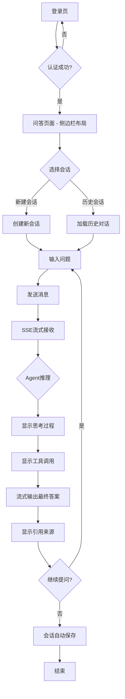
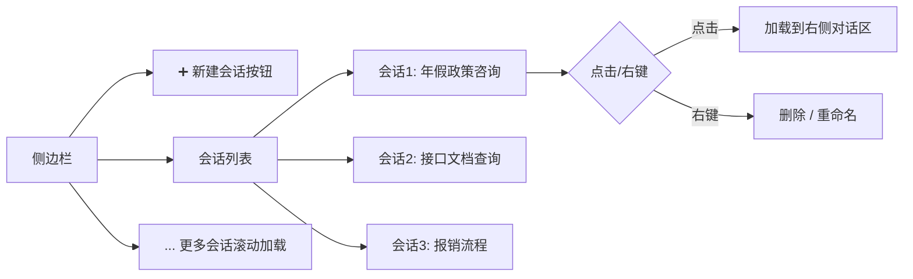
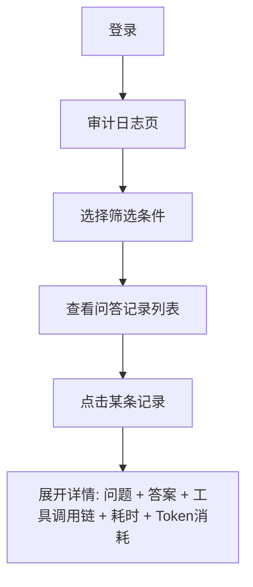

# 企业内部规章制度与技术文档智能问答系统 — 页面清单与原型设计

**文档版本**：v1.0
**编制日期**：2026-07-20
**关联文档**：企业内部规章制度与技术文档智能问答系统 PRD.md (v4.0)

---

## 一、信息架构

```
/login ───────────────────── 登录/注册（无侧边栏）
     │
     ├── /chat ────────────── 智能问答（侧边栏：会话列表）
     ├── /documents ───────── 文档管理（侧边栏：全局导航）
     ├── /history ─────────── 对话历史（侧边栏：全局导航）
     │
     └── [管理员]
          ├── /dashboard ──── 系统概览（侧边栏：全局导航）
          ├── /audit ──────── 审计日志（侧边栏：全局导航）
          └── /users ──────── 用户管理（侧边栏：全局导航）
```

---

## 二、页面清单

### 通用页面（所有角色）

| 序号 | 页面 | 路由 | 核心功能 | 侧边栏 |
|------|------|------|----------|--------|
| P1 | 登录/注册 | `/login` `/register` | JWT认证、注册表单 | 无 |
| P2 | 智能问答 | `/chat` | SSE流式对话、Agent推理过程可视化、溯源引用、会话管理 | 会话列表 |
| P3 | 文档管理 | `/documents` | 文档列表、上传、删除、索引进度、元数据编辑 | 全局导航 |
| P4 | 对话历史 | `/history` | 历史问答记录查看、搜索、继续会话 | 全局导航 |

### 管理员页面

| 序号 | 页面 | 路由 | 核心功能 | 侧边栏 |
|------|------|------|----------|--------|
| P5 | 审计日志 | `/audit` | 全量问答记录、按用户/时间/关键词筛选、导出CSV | 全局导航 |
| P6 | 用户管理 | `/users` | 用户CRUD、角色分配、部门管理 | 全局导航 |
| P7 | 系统概览 | `/dashboard` | 文档数/用户数/问答量统计、服务健康状态 | 全局导航 |

---

## 三、用户流程

### 3.1 员工问答（核心流程）



### 3.2 侧边栏会话管理



### 3.3 管理员上传文档

```mermaid
flowchart TD
    A[登录] --> B[文档管理页]
    B --> C[点击上传]
    C --> D[选择文件 + 填写元数据]
    D --> E[文件上传至MinIO]
    E --> F[状态: UPLOADED]
    F --> G[点击"开始索引"]
    G --> H[状态: INDEXING]
    H --> I[WebSocket推送进度]
    I --> J{索引结果}
    J -->|成功| K[状态: COMPLETED]
    J -->|失败| L[状态: FAILED + 显示原因]
```

### 3.4 管理员查看审计



---

## 四、页面低保真原型

### P1: 登录/注册页 `/login` `/register`

```
                                    ┌──────────────────────┐
                                    │                      │
                                    │   🏢 企业智能问答    │
                                    │   内部知识库助手     │
                                    │                      │
                  ┌─────────────────┴──────────────────────┴─────────────────┐
                  │                                                        │
                  │   [登录] [注册]                                         │
                  │   ─────────────                                         │
                  │                                                        │
                  │   ┌──────────────────────────────────────────────┐     │
                  │   │  用户名     [________________]               │     │
                  │   │  密码       [________________]               │     │
                  │   │                                              │     │
                  │   │  [  登  录  ]                                │     │
                  │   │                                              │     │
                  │   │  还没有账号？立即注册 →                       │     │
                  │   └──────────────────────────────────────────────┘     │
                  │                                                        │
                  │   ── 注册表单（切换到注册时显示）──                     │
                  │   ┌──────────────────────────────────────────────┐     │
                  │   │  用户名     [________________]               │     │
                  │   │  邮箱       [________________]               │     │
                  │   │  密码       [________________]               │     │
                  │   │  部门       [▼ 技术部]                       │     │
                  │   │                                              │     │
                  │   │  [  注  册  ]                                │     │
                  │   └──────────────────────────────────────────────┘     │
                  │                                                        │
                  └────────────────────────────────────────────────────────┘
```

---

### P2: 智能问答页 `/chat`

```
┌──────────────────────────────────────────────────────────────────────────┐
│  HEADER                                                [用户名] [退出]  │
├────────────┬─────────────────────────────────────────────────────────────┤
│            │                                                             │
│  📁 侧边栏  │  ┌─────────────────────────────────────────────────────┐  │
│  (260px)   │  │  会话标题: 年假政策咨询                               │  │
│            │  └─────────────────────────────────────────────────────┘  │
│ [+ 新建会话]│                                                             │
│            │  ┌──────────────────────────────────────────────┐          │
│ ▸年假政策.. │  │  🤖 Agent思考过程（可折叠）                  │          │
│  接口文档.. │  │  ├─ 💭 分析用户意图: 查询年假政策            │          │
│  报销流程.. │  │  ├─ 🔧 调用工具: search_knowledge("年假")       │          │
│  项目排期.. │  │  └─ 📋 检索到3条相关文档                    │          │
│  考勤制度.. │  └──────────────────────────────────────────────┘          │
│            │                                                             │
│            │  ┌──────────────────────────────────────────────┐          │
│            │  │  📝 根据《员工手册》第三章，入职满1年员工     │          │
│            │  │  享有5天带薪年假。年假需提前3个工作日申请。  │          │
│            │  │                                              │          │
│            │  │  📎 引用来源:                                │          │
│            │  │    · 员工手册 v3.2 — 第三章 休假制度          │          │
│            │  │    · 考勤管理办法 v1.0 — 第四条               │          │
│            │  └──────────────────────────────────────────────┘          │
│            │                                                             │
│            │  ┌──────────────────────────────────────────────┐          │
│            │  │  输入你的问题...                    [发送]    │          │
│            │  └──────────────────────────────────────────────┘          │
│            │                                                             │
└────────────┴─────────────────────────────────────────────────────────────┘
```

**侧边栏状态说明**：

| 状态 | 表现 |
|------|------|
| 默认（无选中会话） | 对话区显示欢迎语 + 输入框 |
| 选中会话 | 加载历史消息，对话区显示完整对话 |
| 新建会话 | 侧边栏顶部新增"新会话"，对话区清空 |
| 右键会话 | 弹出菜单：重命名 / 删除 |
| 空状态 | 侧边栏显示"暂无会话，开始提问吧" |

---

### P3: 文档管理 `/documents`

```
┌──────────────────────────────────────────────────────────────────────────┐
│  HEADER                                                  [用户名] [退出] │
├────────────┬─────────────────────────────────────────────────────────────┤
│            │                                                             │
│  📋 导航    │  文档管理                                                   │
│            │                                                             │
│  ▸ 概览     │  [🔍 搜索文档...]  [部门 ▼ 全部]  [状态 ▼ 全部]  [+ 上传] │
│   智能问答  │                                                             │
│   文档管理  │  ┌──────────────────────────────────────────────────────┐  │
│   对话历史  │  │ 文档名称          │部门  │密级  │状态     │操作      │  │
│  ─────────  │  ├──────────────────────────────────────────────────────┤  │
│  🔧 管理    │  │ 员工手册 v3.2     │HR   │公开  │✅ 已索引│👁 📋 🗑 │  │
│   审计日志  │  │ 考勤管理办法       │HR   │内部  │✅ 已索引│👁 📋 🗑 │  │
│   用户管理  │  │ 技术规范-API设计   │技术  │内部  │🔄 索引中│👁       │  │
│            │  │ 财务报销制度       │财务  │机密  │✅ 已索引│👁 📋 🗑 │  │
│            │  │ 故障处理预案       │运维  │内部  │❌ 失败  │👁 🔄 🗑 │  │
│            │  └──────────────────────────────────────────────────────┘  │
│            │                                              [← 1 2 3 →]  │
│            │                                                             │
│            │  ── 点击 [+ 上传] 弹出上传对话框 ──                          │
│            │  ┌──────────────────────────────────────────────────────┐  │
│            │  │  上传文档                                       [✕]  │  │
│            │  │                                                      │  │
│            │  │  ┌─────────────────────────────────────────────────┐ │  │
│            │  │  │  拖拽文件到此处 或 点击选择文件                  │ │  │
│            │  │  │  支持 PDF / Word / Markdown / TXT               │ │  │
│            │  │  └─────────────────────────────────────────────────┘ │  │
│            │  │                                                      │  │
│            │  │  文档标题  [__________________________]              │  │
│            │  │  所属部门  [▼ 技术部]   密级  [▼ 内部]              │  │
│            │  │  标签      [接口] [API] [+添加]                      │  │
│            │  │                                                      │  │
│            │  │  [取消]              [上传并开始索引]                 │  │
│            │  └──────────────────────────────────────────────────────┘  │
│            │                                                             │
└────────────┴─────────────────────────────────────────────────────────────┘
```

**文档状态与操作映射**：

| 状态 | 可用操作 |
|------|----------|
| `UPLOADED` | 👁 预览文件, 📋 开始索引, 🗑 删除 |
| `INDEXING` | 👁 预览文件（禁用其他操作） |
| `COMPLETED` | 👁 预览文件, 📋 重新索引, 🗑 删除 |
| `FAILED` | 👁 预览文件, 🔄 重试索引, 🗑 删除 |

---

### P4: 对话历史 `/history`

```
┌──────────────────────────────────────────────────────────────────────────┐
│  HEADER                                                  [用户名] [退出] │
├────────────┬─────────────────────────────────────────────────────────────┤
│            │                                                             │
│  📋 导航    │  对话历史                                                   │
│            │                                                             │
│  ▸ 概览     │  [🔍 搜索对话内容...]  [📅 2026-07-20]  [清空筛选]        │
│   智能问答  │                                                             │
│   文档管理  │  ┌──────────────────────────────────────────────────────┐  │
│   对话历史  │  │ 日期       │会话标题        │消息数│最后提问         │  │
│  ─────────  │  ├──────────────────────────────────────────────────────┤  │
│  🔧 管理    │  │ 07-20 14:30│年假政策咨询    │ 6条  │年假可以累计吗   │  │
│   审计日志  │  │ 07-20 11:15│接口文档查询    │ 4条  │登录接口返回401  │  │
│   用户管理  │  │ 07-19 16:42│报销流程        │ 8条  │差旅费标准多少   │  │
│            │  │ 07-19 10:08│考勤制度        │ 3条  │迟到扣款规则     │  │
│            │  │ 07-18 15:22│项目排期        │ 5条  │Q3交付截止日     │  │
│            │  └──────────────────────────────────────────────────────┘  │
│            │                                              [← 1 2 3 →]  │
│            │                                                             │
│            │  ── 点击某条记录后展开详情 ──                                │
│            │  ┌──────────────────────────────────────────────────────┐  │
│            │  │  年假政策咨询                           [继续此会话]  │  │
│            │  │  ──────────────────────────────────────────────────   │  │
│            │  │  👤 Q: 年假有多少天？                       14:30    │  │
│            │  │  🤖 A: 根据《员工手册》第三章，入职满1年... 14:30    │  │
│            │  │      📎 来源: 员工手册 v3.2 — 第三章                 │  │
│            │  │  👤 Q: 年假可以累计到下一年吗？              14:31    │  │
│            │  │  🤖 A: 年假原则上不跨年累计...              14:31    │  │
│            │  └──────────────────────────────────────────────────────┘  │
│            │                                                             │
└────────────┴─────────────────────────────────────────────────────────────┘
```

**"继续此会话" 行为**：点击后跳转至 `/chat?session_id=xxx`，在问答页面加载该历史会话的全部消息，用户可继续提问。

---

### P5: 审计日志 `/audit`（管理员）

```
┌──────────────────────────────────────────────────────────────────────────┐
│  HEADER                                                  [👤 管理员] [退出]│
├────────────┬─────────────────────────────────────────────────────────────┤
│            │                                                             │
│  📋 导航    │  审计日志                                                   │
│            │                                                             │
│  ▸ 概览     │  [👤 用户 ▼ 全部] [📅 日期范围] [🔍 关键词]  [导出CSV]    │
│   智能问答  │                                                             │
│   文档管理  │  ┌──────────────────────────────────────────────────────┐  │
│   对话历史  │  │ 用户     │问题          │工具调用     │耗时  │时间   │  │
│  ─────────  │  ├──────────────────────────────────────────────────────┤  │
│  🔧 管理    │  │ 张三    │年假有多少天  │search_knowledge│2.3s │14:30  │  │
│   审计日志  │  │ 李四    │登录接口401   │search_knowledge   │3.1s │11:15  │  │
│   用户管理  │  │ 王五    │差旅费标准    │search_knowledge│1.8s │10:08  │  │
│            │  │ 张三    │项目截止日    │search_knowledge   │4.2s │09:42  │  │
│            │  │ 赵六    │机房故障预案  │search_knowledge   │2.9s │08:55  │  │
│            │  └──────────────────────────────────────────────────────┘  │
│            │                                              [← 1 2 3 →]  │
│            │                                                             │
│            │  ── 点击某条记录后展开完整详情 ──                             │
│            │  ┌──────────────────────────────────────────────────────┐  │
│            │  │  审计详情 — ID: #1287                                 │  │
│            │  │  ───────────────────────────────────────────────────  │  │
│            │  │  用户: 张三 (技术部)    时间: 2026-07-20 14:30:12    │  │
│            │  │  问题: 年假有多少天？                                  │  │
│            │  │  回答: 根据《员工手册》第三章...                       │  │
│            │  │  工具调用链:                                          │  │
│            │  │    └─ search_knowledge(query="年假", dept="技术部")      │  │
│            │  │  Token消耗: 输入 856 / 输出 234                        │  │
│            │  │  响应耗时: 2.3s                                        │  │
│            │  └──────────────────────────────────────────────────────┘  │
│            │                                                             │
└────────────┴─────────────────────────────────────────────────────────────┘
```

**操作说明**：

| 操作 | 说明 |
|------|------|
| 单条删除 | 每行右侧删除按钮，ElPopconfirm 确认后删除 |
| 批量删除 | 勾选多条后，顶部出现"批量删除"按钮，ElMessageBox 确认后执行 |
| 查看详情 | 点击行展开完整审计详情（问题、回答、工具调用链、耗时、错误信息） |

**筛选条件**：

| 筛选项 | 类型 | 说明 |
|--------|------|------|
| 用户 | 下拉多选 | 按用户名筛选 |
| 日期范围 | 日期选择器 | 起止日期 |
| 关键词 | 文本输入 | 模糊搜索问题和答案内容 |

---

### P6: 用户管理 `/users`（管理员）

```
┌──────────────────────────────────────────────────────────────────────────┐
│  HEADER                                                  [👤 管理员] [退出]│
├────────────┬─────────────────────────────────────────────────────────────┤
│            │                                                             │
│  📋 导航    │  用户管理                                                   │
│            │                                                             │
│  ▸ 概览     │  [🔍 搜索用户...]  [角色 ▼ 全部]  [部门 ▼ 全部]  [+ 新增] │
│   智能问答  │                                                             │
│   文档管理  │  ┌──────────────────────────────────────────────────────┐  │
│   对话历史  │  │ 用户名   │邮箱            │部门   │角色     │操作    │  │
│  ─────────  │  ├──────────────────────────────────────────────────────┤  │
│  🔧 管理    │  │ 张三    │zhang@co.com   │技术部 │员工     │✏️ 🗑   │  │
│   审计日志  │  │ 李四    │li@co.com      │HR部   │HR      │✏️ 🗑   │  │
│   用户管理  │  │ 王五    │wang@co.com    │技术部 │主管     │✏️ 🗑   │  │
│            │  │ admin   │admin@co.com   │IT部   │管理员   │✏️      │  │
│            │  └──────────────────────────────────────────────────────┘  │
│            │                                              [← 1 2 3 →]  │
│            │                                                             │
│            │  ── 点击 [+ 新增] 或 [✏️] 弹出编辑对话框 ──                  │
│            │  ┌──────────────────────────────────────────────────────┐  │
│            │  │  新增用户 / 编辑用户                            [✕]   │  │
│            │  │                                                      │  │
│            │  │  用户名    [________________]                        │  │
│            │  │  邮箱      [________________]                        │  │
│            │  │  密码      [________________]  (新增时必填)          │  │
│            │  │  部门      [▼ 技术部]                                │  │
│            │  │  角色      [▼ ROLE_EMPLOYEE]                         │  │
│            │  │            ○ ROLE_EMPLOYEE  员工                     │  │
│            │  │            ○ ROLE_LEADER    主管                     │  │
│            │  │            ○ ROLE_HR        HR                       │  │
│            │  │            ○ ROLE_ADMIN     管理员                   │  │
│            │  │                                                      │  │
│            │  │  [取消]                        [保存]                 │  │
│            │  └──────────────────────────────────────────────────────┘  │
│            │                                                             │
└────────────┴─────────────────────────────────────────────────────────────┘
```

**角色权限矩阵**：

| 功能 | ROLE_EMPLOYEE | ROLE_LEADER | ROLE_HR | ROLE_ADMIN |
|------|:---:|:---:|:---:|:---:|
| 智能问答 | ✓ | ✓ | ✓ | ✓ |
| 文档查看 | ✓ | ✓ | ✓ | ✓ |
| 文档管理(本部门) |  | ✓ | ✓ | ✓ |
| 文档管理(所有部门) |  |  | ✓ | ✓ |
| 对话历史（本人） | ✓ | ✓ | ✓ | ✓ |
| 审计日志(查看+删除) |  |  |  | ✓ |
| 用户管理 |  |  |  | ✓ |
| 系统概览 |  |  |  | ✓ |

---

### P7: 系统概览 `/dashboard`（管理员首页）

```
┌──────────────────────────────────────────────────────────────────────────┐
│  HEADER                                     🔔 通知    [👤 管理员] [退出] │
├────────────┬─────────────────────────────────────────────────────────────┤
│            │                                                             │
│  📋 导航    │  系统概览                                                   │
│            │                                                             │
│  ▸ 概览     │  ┌──────────┐ ┌──────────┐ ┌──────────┐ ┌──────────┐     │
│   智能问答  │  │ 📄 文档数 │ │ 👥 用户数 │ │ 💬 今日   │ │ ⚡ 平均   │     │
│   文档管理  │  │          │ │          │ │   问答数  │ │   响应时间 │     │
│   对话历史  │  │   128    │ │   45     │ │   237    │ │  2.3s    │     │
│  ─────────  │  └──────────┘ └──────────┘ └──────────┘ └──────────┘     │
│  🔧 管理    │                                                             │
│   审计日志  │  ┌──────────────────────────────────────────────────────┐  │
│   用户管理  │  │  📊 近7天问答趋势                                    │  │
│            │  │  ██▌                                                  │  │
│            │  │  ████▌  ███▌                                          │  │
│            │  │  ████▌  ████▌  ███▌  ████▌                            │  │
│            │  │  ████▌  ████▌  ████▌ ████▌  ███▌                      │  │
│            │  │  ──────────────────────────────                       │  │
│            │  │  周一  周二  周三  周四  周五  周六  周日               │  │
│            │  └──────────────────────────────────────────────────────┘  │
│            │                                                             │
│            │  ┌──────────────────────────┐ ┌──────────────────────────┐ │
│            │  │  🟢 Python Agent 正常    │ │  🟢 Qdrant 正常          │ │
│            │  │  🟢 MySQL 正常           │ │  🟢 MinIO 正常           │ │
│            │  │  🟡 LLM API 延迟偏高     │ │  ⚪ Redis 未启用         │ │
│            │  └──────────────────────────┘ └──────────────────────────┘ │
│            │                                                             │
└────────────┴─────────────────────────────────────────────────────────────┘
```

**系统概览数据来源**：

| 指标 | 数据来源 | 更新方式 |
|------|---------|---------|
| 文档数 | MySQL `doc_document` COUNT | 页面加载时查询 |
| 用户数 | MySQL `sys_user` COUNT | 页面加载时查询 |
| 今日问答数 | MySQL `audit_log` COUNT WHERE DATE=today | 页面加载时查询 |
| 平均响应时间 | MySQL `audit_log` AVG(response_time) | 页面加载时查询 |
| 问答趋势 | MySQL 近7天 GROUP BY DATE | 页面加载时查询 |
| 服务健康 | Python `/api/agent/health` + Qdrant/MinIO ping | 每30s轮询 |

---

## 五、侧边栏导航规范

### 5.1 问答页面侧边栏（`/chat`）

```
┌──────────────┐
│ [+ 新建会话]  │  ← 主操作按钮
│              │
│ ──────────── │  ← 分隔线
│              │
│ ▸ 年假政策..  │  ← 当前选中（高亮）
│   接口文档..  │  ← 未选中
│   报销流程..  │
│   项目排期..  │
│   考勤制度..  │
│              │
│ ...更多      │  ← 滚动加载
└──────────────┘
```

- 会话按最后活跃时间倒序排列
- 选中会话高亮，对话区加载对应历史
- 右侧更多区域支持滚动，超出可视区自动显示滚动条
- 会话标题自动截断，超出16字符显示 `...`

### 5.2 管理页面侧边栏（`/dashboard` `/documents` `/history` `/audit` `/users`）

```
┌──────────────┐
│ 📋 导航       │
│              │
│ ▸ 概览        │  ← 仅管理员可见
│   智能问答    │
│   文档管理    │
│   对话历史    │
│ ──────────── │  ← 分隔线
│ 🔧 管理       │
│   审计日志    │  ← 仅管理员可见
│   用户管理    │  ← 仅管理员可见
└──────────────┘
```

- 当前页面高亮
- 管理员专属菜单项对非管理员角色隐藏
- 点击导航项跳转对应路由

---

## 六、全局交互规范

| 规范项 | 说明 |
|--------|------|
| **侧边栏宽度** | 260px，可折叠至 64px（仅图标） |
| **内容区最大宽度** | 1200px，居中显示 |
| **SSE流式输出** | 逐字渲染，光标闪烁效果 |
| **Agent思考过程** | 默认展开，可手动折叠；每条思考/工具调用带独立图标 |
| **引用来源** | 每条引用可点击，弹出原文片段预览 |
| **空状态** | 列表无数据时显示插画 + "暂无数据" 文案 |
| **加载状态** | 骨架屏（Skeleton）占位，避免页面跳动 |
| **错误提示** | 顶部 Toast 通知，3秒自动消失；严重错误使用模态框 |
| **响应式** | 宽度 < 768px 时侧边栏自动隐藏，通过汉堡菜单呼出 |
